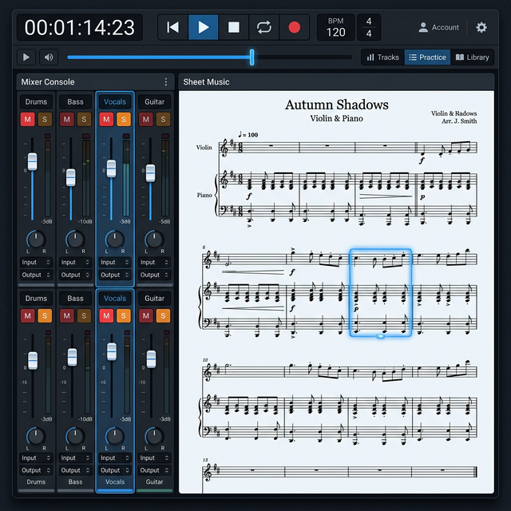
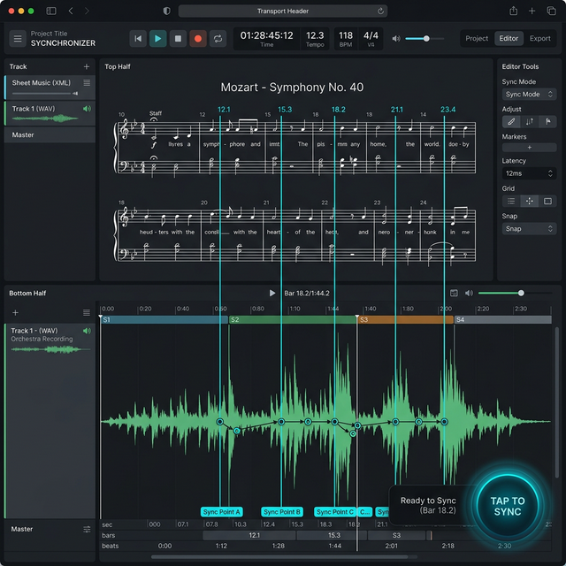
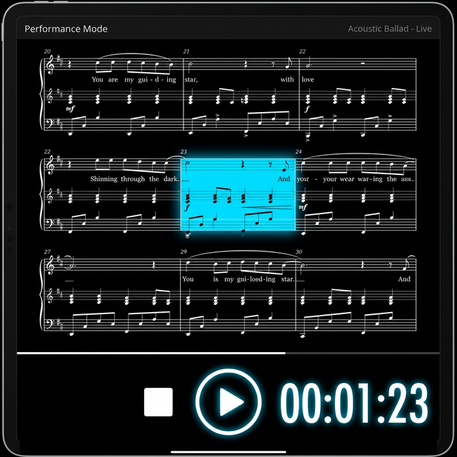

# Thiết Kế Giao Diện: Pro Backing & Score 

Trọng tâm của giao diện mới là mang lại trải nghiệm chuyên nghiệp cho người tập luyện và biểu diễn nhạc sống. Tôi đã tạo một bản vẽ thiết kế (mockup) đính kèm minh họa cho ý tưởng này.

## Cấu Trúc Tổng Thể (The Layout)

Giao diện (Dark Mode) được chia thành 3 phần chính, rất gần với các trình DAW nổi tiếng (Logic Pro, Ableton) nhưng làm tinh gọn lại chỉ cho mục đích Phóng thanh (Playback) & Đọc Sheet.

### 1. Global Header (Transport Bar)
Nằm ở trên cùng, chứa các công cụ điều khiển thời gian:
- **Đồng hồ số lớn (Timer)**: Hiển thị bộ đếm thời gian (MM:SS) lớn, dễ nhìn từ xa (rất quan trọng cho Live).
- **Transport Controls**: Các nút cơ bản Play, Pause, Stop, Loop to và rõ ràng.
- **BPM & Xung/Nhịp (Time Signature)**: Cung cấp thông tin nhịp độ.
- **Seekbar**: Thanh chạy theo chiều ngang hiển thị toàn bộ bài hát.

### 2. Bảng Trái: Mixer Console (Control Stems)
Khu vực này thay thế Sidebar cũ. Nó phục vụ duy nhất một mục đích: Điều khiển Audio Stems.
- Hiển thị danh sách các track Audio ngang hàng nhau theo dạng Cột Dọc (Vertical channel strips).
- Mỗi cột chứa chữ nhãn (ví dụ: `Drums`, `Bass`, `Vocals`, `Guitar`).
- **Nút Mute (M) và Solo (S)** được làm nổi bật với màu sắc đối lập (cam/đỏ ngả vàng) để user dễ bấm bằng tay khi đang cầm nhạc cụ.
- Mỗi cột có **Volume fader** trượt để Mix cân bằng lại âm lượng theo ý thích.

### 3. Bảng Phải: The Sheet Music (MusicXML Visualizer)
Khu vực trung tâm lớn nhất, chiếm 70% không gian màn hình là để hiển thị bản nhạc Verovio (MusicXML).
- Nền trắng sáng, có độ tương phản cực gắt với bảng tối xung quanh khiến nốt nhạc nổi lên hiển nhiên.
- **Tính năng nổi bật:** Đoạn/Ô nhịp (Measure) nào đang được phát bởi Audio sẽ có một **thanh sáng Highlight (màu xanh nước biển nhạt)** bao quanh khuông nhạc để giúp nghệ sĩ không bao giờ bị lạc nhịp. Đọc tới đâu, highlight chạy tới đó.

### Ưu Điểm của Thiết Kế Mới:
- **Loại bỏ sự phiền nhiễu:** Không có Timeline Arrangement rắc rối, không bắt người dùng cắt ghép pattern. User chỉ cần mở file -> Chỉnh Mixer Mute/Solo -> Đọc sheet nhạc nổi bật và tập theo nhạc.
- Chuyên nghiệp, gọn gàng, mang dáng vấp của một "Virtual Studio" kết hợp "Smart Sheet Music". Mời bạn tham khảo!

---

## Tính Năng Nâng Cao

Dưới đây là thiết kế bổ sung cho 2 tính năng quan trọng nhất của hệ thống: **Khớp Nhịp (Magic Sync)** và **Biểu Diễn (Live Performance Mode)**.

### Màn Hình Khớp Nhịp (Magic Sync Editor)
Đóng vai trò là công cụ "Timemap Builder" giúp đồng bộ đoạn Audio gốc và Sheet Nhạc với nhau.

- **Nửa trên:** Hiển thị MusicXML, cho phép User nhấp chọn ô nhịp (Measure) cụ thể.
- **Nửa dưới:** Hiển thị dạng sóng (Waveform) của Audio.
- **Lập bản đồ (Mapping):** User sẽ thấy các đường nối đồng bộ (Sync lines) từ khuông nhạc thả xuống Audio. Họ có thể bấm nút **"Tap To Sync"** (Gõ nhịp không gian) trong quá trình bài hát đang chạy để hệ thống tự động ghim (Pin) ô nhịp tương ứng vào thời gian thời điểm đó.

### Chế Độ Biểu Diễn Trực Tiếp (Live Performance Mode)
Dành cho nhạc công đem lên sân khấu (Sử dụng iPad/Tablet). Không cần thao tác chuột hay edit gì cả.

- **Sức mạnh hiển thị:** View sẽ thu gọn toàn bộ Mixer. Không gian hiển thị Sheet MusicXML được ưu tiên lớn nhất (85% diện tích màn hình).
- **Dark Mode Tuyệt Đối:** Sử dụng màu đen và font trắng cực nổi (High Contrast) để chống lóa đèn ánh sáng sân khấu (Stage glare).
- **Biểu tượng quá khổ (Gig-ready):** Đồng hồ đếm ngược và thanh Play/Stop ở dưới cùng được phóng to khổng lồ để ca sĩ/nhạc công có thể ấn lướt tay dễ dàng nhất. Khuông nhạc nào đang phát được Highlight bằng công nghệ Neon sáng rực rỡ báo hiệu.
